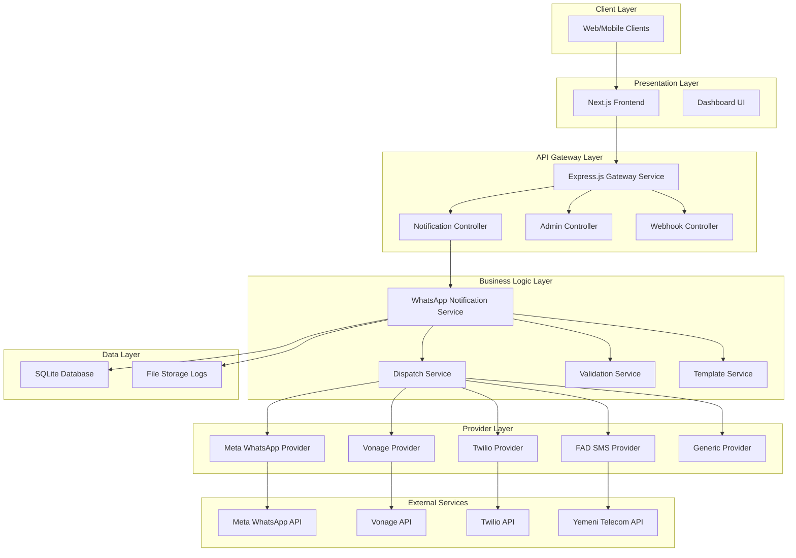
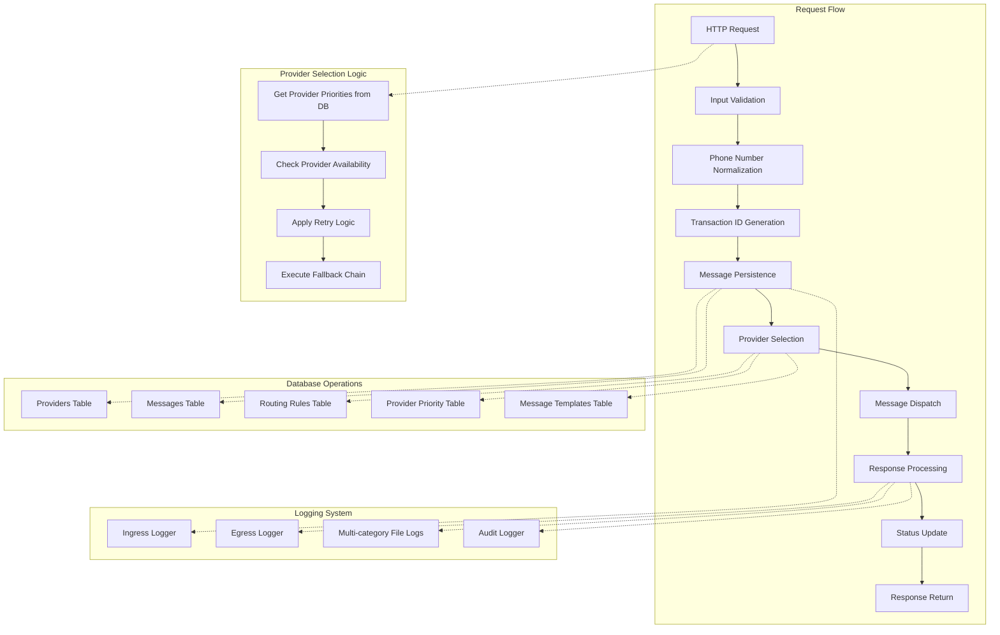
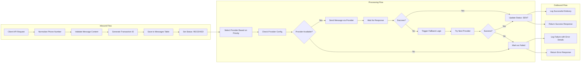
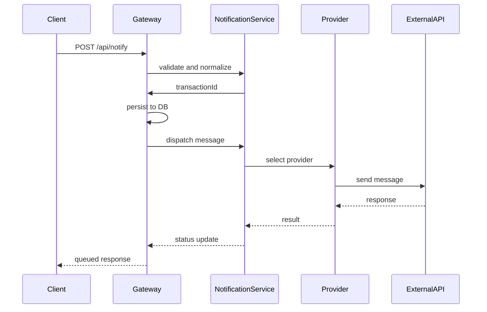
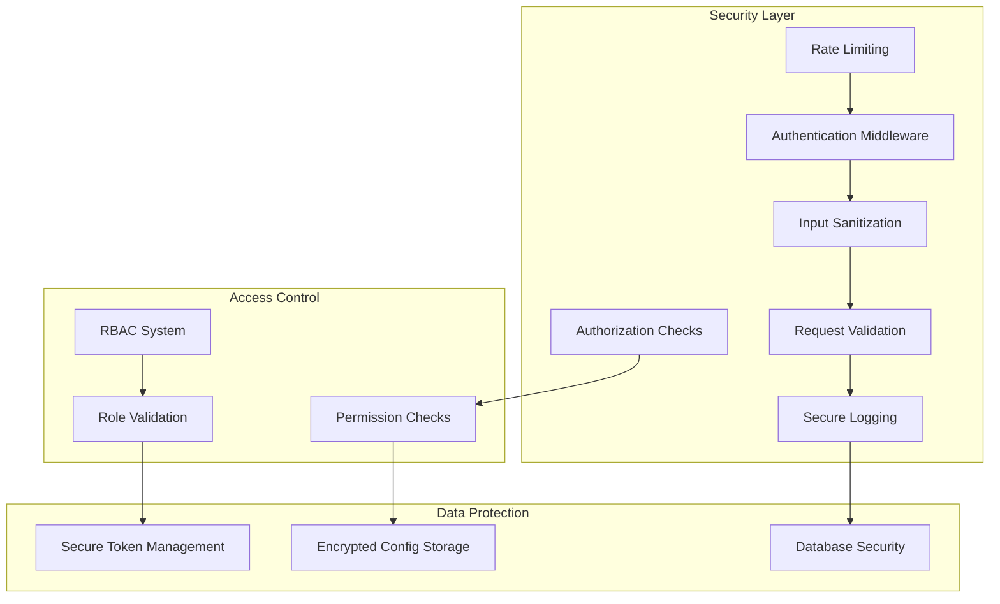

# WhatsApp Messaging System - Architecture Diagrams

## High-Level Architecture (HLD)

## Low-Level Architecture (LLD)

## Data Flow Diagram

## Component Interaction Diagram

## Security Architecture

